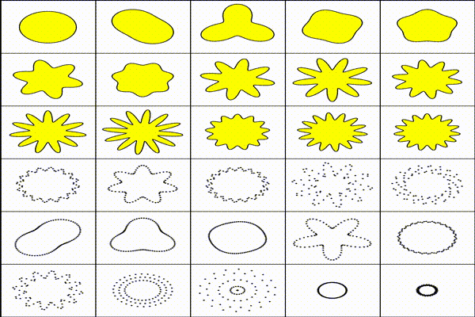

This is motion sample for ameba.
This code is strongly depends on p5.js library.
Need to use with it by instance mode.


## ameba animation


## Generator
You can test ameba shapes. Go to [p5-ameba-generator](https://github.com/mitsuyacider/p5-ameba-generator) or visit [here](https://www.openprocessing.org/sketch/674184).

## Getting started
### Usage
### ES6 modules
```
import ameba from 'path/to/ameba.js';
```

## Hello world
**NOTE:**
Need to pass p5 instance on initialization.
```
const creature = new ameba(p5, {
    "frequency": 12,
    "amplitude": 12,
    "ampSpeed" : 0.5,
    "frequencySpeed": 0.05,
    "ampRange": 1
})
```

#### wiggle animation
If you need animation, call `updateParameter` method every frame before `draw` method otherwise ameba remain to be static.
```
creature.updateParameter()
```
#### draw
You can select draw type in dots or fill/storke. If you select fill/stroke type, at first you should set the specific color with either of stroke and fill or both. After setting the color, draw ameba. Three kinds of draw-types are prepared.

* wireframe
```:wireframe
p5.stroke(255)
p5.noFill();
creature.draw(x, y);
```

* fill
```:fill
p5.noStroke();
p5.fill(255);
creature.draw(x, y);
```

* dots<br>
enable to change dot size.
```:dots
const dotsize = 1;
p5.noStroke();
p5.fill(255);
creature.drawWithDot(x, y, dotsize);
```

## Parameter
|param|description|default|
|:--|:--|:--|
|frequency|wave length (number of wave)|12|
|amplitude|wave height|12|
|ampSpeed|wiggle animation speed|0.05|
|ampRange|span between min and max for wiggle animation|1|
|step|resolution of ameba|1|
|dots|roundness of ameba|360|
|frequencySpeed|non-supported|non-supported|
